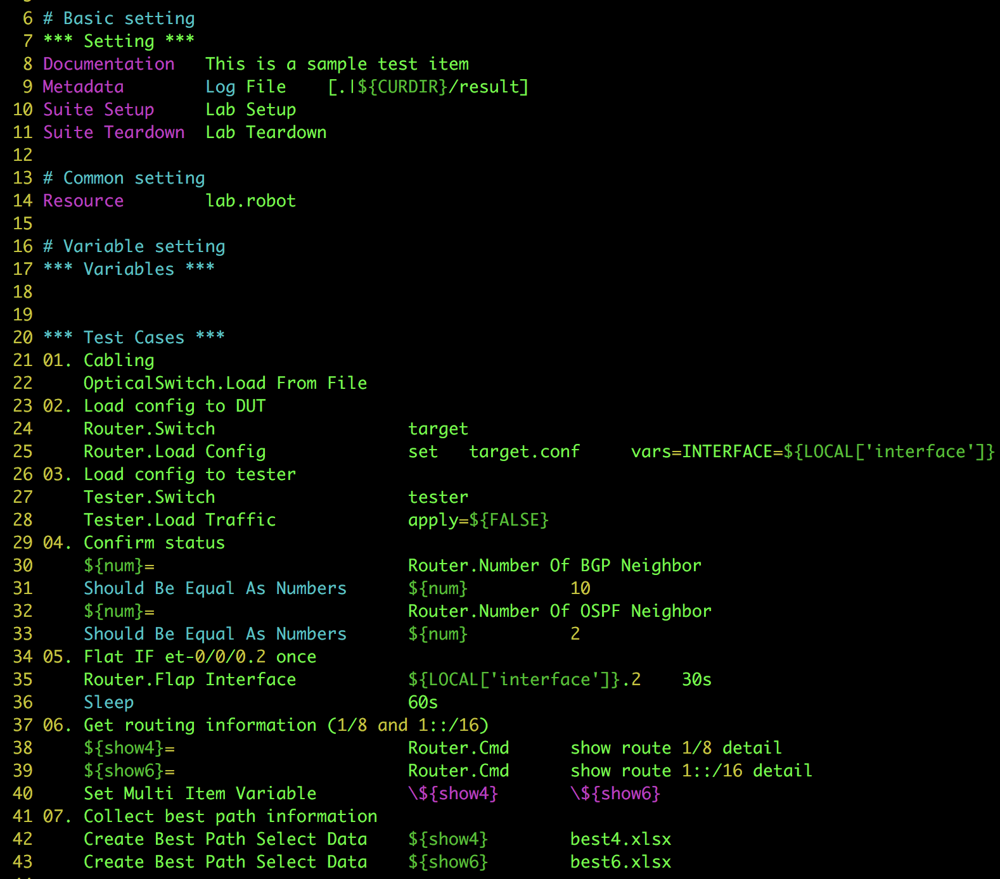

# RENAT

A Robotframework Extension for Network Automated Testing

---

 


## Disclaimer

The Authors assume no responsibility for damage or loss of system
performance as a direct or indirect result of the use of this
software.  This software is provided "as is" without express or
implied warranty.

All product names and trademarks are the property of their respective owners, which are in no way associated or affiliated with this software. Use of these names does not imply any co-operation or endorsement.
- Ixia, IxiaNetwork, IxiaLoad are trademarks of IXIA 
- Spirent, Avalanche are trademarks of Spirent
- Calient is a trademark of CALIENT NETWORKS, INC.
- Junos, Juniper are trademarks of Junipter Networks.
- Cisco is a trademark of Cisco Systems, Inc.

For details about Robot Framework see [RobotFramework](http://www.robotframework.org/)

--- 

## Table of contents

- [Disclaimer](#disclaimer)
- [Table Of Contents](#table-of-contents)
- [Features](#features)
- [A glimpse of RENAT by docker](#a-glimpse-of-renat-by-docker)
- [Installation by Ansible](#installation-by-ansible)
- [Installation for CentOS7](#installation-for-centos7)
- [Installation for CentOS6](#installation-for-centos6)
- [RENAT checkout and preparation](#renat-checkout-and-preparation)
- [Create scenarios](#create-scenarios)
- [More Examples](#more-examples)
- [Manual](#manual)
- [Copying And Copyrights](#copying-and-copyrights)
- [Thanks](#thanks)

For the impatient users, see [renat by docker](#a-glimpse-of-renat-by-docker) for a quick trial.

## Features
The framework provides an simple way to conduct Network Automated Testing by using simple scenario

RENAT features:
- a Robot-framework (RF) library aims to support NW testing with easy-to-write plain-text scenario utilizing all features of current RF
- supports end-to-end NW testing process in a large scale lab environment
- highly reusable scenarios with data-logic separated format and well-structured test project/ items
- supports multi access types to NW appliances including telnet/ssh (ssh proxy) and web access
- simulates user’s actions, keystrokes in details with virtual terminals
- conceals common access, logging process to focus on the test’s content easily 
- supports a wide range of NW devices including routers, switches, L1 optic switch and web appliances out-of-the-shelves
- supports hypervisors and webMKS
- flexible  modular and multi-vendors architecture, easy to customize
- currently supported platforms:
    - routers/switches: Cisco, Junipers, GR, Alcatel Lucent, Yamaha
    - L1 switches: Calient, G4NMT
    - testers: IxiaNetwork, IxiaLoad, IxiaBreakingPoint, Spirent Avalanche
    - hypervisors: VMware
    - servers: *unix system
    - others platforms: SmartCS, ArborSP, Samurai (a NTTCOM product)

*Notes*: Supports could be variant on OS versions




## A glimpse of RENAT by docker
A super simple way to try RENAT is running it from a container. Below are instructions.

*Notes*: this container does not include proprietary softwares. See manuals for more details on how to install those.

1. import docker image from dockerhub

    ```
    $ docker pull bachng/renat:latest
    ```

2. start the container that open port 80 and 10022

    ```
    $ mkdir -p /opt/renat
    $ docker run --rm -d --privileged -v /opt/renat:/opt/renat -p 80:80 -p 10022:22 --name renat bachng/renat:latest
    ```

    At this point, a RENAT server will all necessary packages and latest RENAT is ready with predefined `robot` user. 

    The folder `/opt/renat` on the container is also bound to `/opt/renat` on the host.

3. login to the container as `robot` user

    ```
    $ docker exec -it --user robot renat /bin/bash --login
    ```
    or using SSH with `robot/password!secret` account
    ```
    $ ssh -l robot -p 10022 <host_ip>
    ```

4. create a test scenario. Enter `y` to create a local configuration file and `Enter` for other questions.

    ```
    [robot@afeb42da1974 renat]$ $RENAT_PATH/tools/project.sh renat-sample
    [robot@afeb42da1974 renat]$ cd renat-sample
    [robot@afeb42da1974 renat]$ $RENAT_PATH/tools/item.sh test01
    ```

    A `do nothing` scenario is made. Check test01/main.robot for more details
5. run and check the result

    ```
    [robot@afeb42da1974 renat]$ cd test01
    [robot@afeb42da1974 renat]$ ./run.sh 
    ```

    Test results and logs could be checked by `http://<this machine IP>/~robot/result.log`

6. to use with real devices for useful tests, edit below files for correct information
    - $RENAT_PATH/config/device.yaml: device's IP
    - $RENAT_PATH/config/auth.yaml: authentication (username/password)
    - $RENAT_PATH/config/template.yaml(optional): in case current templates are not fit for your devices
    
See [Create scenarios](#create-scenarios) for more detail about creating a sample to interact with routers.

    
## Installation by Ansible
Installation instructions using Ansible
1. prepare an Ansible server
Prepare an Ansible service with necessary packages

2. install a base CentOS
    - install a base CentOS7 with `minimum distribution` and `developer package`
    - set and remember password for the root account

3. prepare the playbook
    - extract playbooks from `misc/ansible-renat-github.tar.gz`
    - add an entry in ansible server for the install target `genesis` in `/etc/hosts` file

        ```
        10.128.64.2     genesis
        ```

    - edit `ansible-renat-github/inventories/host` and change the password `password` to the correct password set in step #2

        ```
        [renat:vars]
        ansible_ssh_user=root
        ansible_ssh_pass=password
        ```

    - if the target is behind a proxy, configure the proxy IP in `host_vars/genesis`

4. run the playbook

    ```
    $ cd ansible-renat-github
    $ ansible-playbook -i inventories/host -e "hosts=genesis" RENAT_INSTALL.yml -vvvv --diff
    ```

The playbook will install necessary packages and environment for RENAT

Add necessary more users and go to [here](#renat-checkout-and-preparation) to continue

## Installation for CentOS7
Basic install instruction for Centos7 and Python3

### 1. base install
Install a typical Centos7 with following parameters:

    - memory: 16G (or more)
    - HDD: 64G (or more)
    - NIC: 2
    - package: minimum (+developer package)
    - ip address: 10.128.64.10/16 (sample)
    - gw: 10.128.1.1 (sample)
    - dns: 10.128.3.101 (sample)
    - hostname: renat.localhost (sample)

### 2. post install configuration
- disable SE linux:
    - disable the feature

        ```
        $ set enforce 0
        ```

    - configure `SELINUX=disabled` in the `/etc/selinux/config` file:

- update install package and `reboot` the system

    ```
    $ yum update -y
    $ reboot
    ```
        
### 3. library installation
- install python3 and related library

    ```
    $ yum install -y python3 python3-libs python3-devel python3-pip
    $ pip3.6 install --upgrade pip 
    ```

- install extra libraries

    ```
    $ yum install -y net-snmp net-snmp-devel net-snmp-utils czmq czmq-devel python3-tkinter xorg-x11-server-Xvfb  vim httpd xorg-x11-fonts-75dpi  nfs samba4 samba-client samba-winbind cifs-utils tcpdump hping3 telnet nmap wireshark java-1.8.0-openjdk firefox telnet ld-linux.so.2 ghostscript ImageMagick vlgothic-fonts vlgothic-p-fonts ntp openssl sshpass
    $ pip3.6 install pytest-runner
    $ pip3.6 install numpy pyte PyYAML openpyxl Jinja2 pandas lxml requests netsnmp-py pdfkit robotframework robotframework-selenium2library robotframework-sshlibrary docutils pyvmomi PyVirtualDisplay pyscreenshot pillow decorator imgurscrot opencv-python pytesseract
    ```
    
- install libraries (besides yum)

    ```
    $ cd /root
    $ mkdir -p work/download

    $ cd /root/work/download
    $ wget https://github.com/mozilla/geckodriver/releases/download/v0.21.0/geckodriver-v0.21.0-linux64.tar.gz
    $ tar xzvf /root/work/download/geckodriver-v0.21.0-linux64.tar.gz -C /usr/local/bin

    $ cd /root/work/download
    $ wget https://downloads.wkhtmltopdf.org/0.12/0.12.5/wkhtmltox-0.12.5-1.centos7.x86_64.rpm
    $ rpm -Uvh wkhtmltox-0.12.5-1.centos7.x86_64.rpm
    ```

- install jenkins (optional)

    ```
    $ cd work/download        
    $ sudo wget -O /etc/yum.repos.d/jenkins.repo http://pkg.jenkins-ci.org/redhat-stable/jenkins.repo
    $ sudo rpm --import https://jenkins-ci.org/redhat/jenkins-ci.org.key
    $ yum install -y jenkins
    ```
        
### 4. more system configuration 
- modify NTP server
    - modify /etc/ntp.conf for favourite NTP server
    - activate and make the service auto start
       ```
       $ service ntpd start
       $ chkconfig ntpd on
       ```
    - check the current NTP
       ```
       $ ntpq -p
       ```

- sudo privilege
    - add a file named `renat` (persion 0440) to folder `/etc/sudoers.d`
    
        ```
        Defaults    env_keep += "PATH PYTHONPATH LD_LIBRARY_PATH MANPATH XDG_DATA_DIRS PKG_CONFIG_PATH RENAT_PATH"
        Cmnd_Alias CMD_ROBOT_ALLOW  = /bin/kill,/usr/local/bin/nmap,/usr/sbin/hping3,/usr/sbin/tcpdump
        %renat ALL=NOPASSWD: CMD_ROBOT_ALLOW
        %jenkins ALL=NOPASSWD: CMD_ROBOT_ALLOW        
        ```
        
    - comment out the line including `secure_path` in the file `/etc/sudoers`
    
        ```
        # Defaults    secure_path = /sbin:/bin:/usr/sbin:/usr/bin
        ```
        
- change some system default behaviours
    - create a folder name `work` under `/etc/skel` with permission `0775`
    - change `UMASK` to `022` in the file `/etc/login.defs`

        ```
        # UMASK           077
        UMASK           022
        ```
        
- add a default group and user and set its password

    ```
    $ groupadd renat -o -g 1000
    $ useradd robot -g renat
    $ passwd robot
    ```

    *Note*: the password of this `robot` account is set in the RENAT config file `${RENAT_PATH}/config/config.yaml`

- configure renat log
    - prepare a log folder

    ```
    $ mkdir /var/log/renat
    $ chown root:renat /var/log/renat
    $ chmod 0775 /var/log/renat
    ```

    - add setting for renat to the end of `/etc/rsyslog.conf`

    ```
    # All renat log to same place
    local5.*                        /var/log/renat/renat.log
    ```

    - and restart the rsyslog daemon

    ```
    $ service rsyslog restart
    ```

    - prepare a logrotate file `/etc/logrotate.d/renat`

    ```
    /var/log/renat/renat.log {
        daily
        rotate 90
        missingok
        notifempty
        copytruncate
        dateext
        dateformat %Y-%m-%d
    }
    ```

- configure jenkins (optional):
    - Change jenkins listen port `JENNKINS_PORT` to `8002` in file `/etc/sysconfig/jenkins`
    
        ```
        # JENKINS_PORT="8080"
        JENKINS_PORT="8082"
        ```
        
    - enable the service
    
        ```
        $ systemctl enable jenkins
        $ systemctl start jenkins
        ```

- configure iptables:
    By default, Centos7 does not support saving iptables from `service` command. 
    ```
    $ systemctl stop firewalld
    $ systemctl disable firewalld
    $ yum install -y iptables-services
    $ systemctl enable iptables.service
    $ systemctl start iptables.service
    ```
    
    Then configure `iptables` to allow necessary ports like `80`,`8082`,`22` and traffic from IxiaAppServer.
    Or allow access for your whole local network:
    ```
    -A INPUT -s 10.128.0.0/16 -j ACCEPT
    ```

- configure httpd service
    - add `apache` to `renat` group
    - modify `userdir.conf` under folder `/etc/httpd/conf.d` to show list the `work` folder of each user
    
        ```
        # UserDir disabled
        UserDir enabled

        # UserDir public_html
        UserDir work

        # <Directory "/home/*/public_html">
         <Directory "/home/*/work">
           IndexOptions +NameWidth=*
        ```
        
        *Note*: Do not for get the `<Directory>` section
            
    - add robot to mime type in file `/etc/mime.types`
        ```
        # text/plain            txt asc text pm el c h cc hh cxx hxx f90 conf log
        text/plain              txt asc text pm el c h cc hh cxx hxx f90 conf log robot
        ```
    - prepare the document folder
    
        ```  
        $ mkdir -p /var/www/html/renat-doc
        $ chown apache:renat /var/www/html/renat-doc/
        $ chmod 0775 /var/www/html/renat-doc/
        ```
            
    - enable and restart the service
    
        ```
        $ systemctl restart httpd
        $ systemctl enable httpd
        ```

- make skeleton for users
    - create a folder call `work` under `/etc/skel` with mode `0750`

### 5. add a renat user
- add a user (e.g. robot) to the group `renat`

    ```
    $ useradd robot -g renat
    $ passwd robot
    ```

- login as the new user
    
- create a key for the account `robot` that would be used for using with SSH proxy. Enter when asked for password (2 times)

    ```
    $ mkdir ~/.ssh
    $ cd ~/.ssh
    $ ssh-keygen -C for_robot_`whoami` -f robot_id_rsa
    
- push to key to proxy server using `robot` password
    ```
    $ ssh-copy-id -i robot_id_rsa.pub robot@<proxy server IP>
    ```

### 6. install Ixia related (optional)
- download necessary files (below are samples. Use the correct install files in your environment)

    ```
    BPSRobotLibrary.tgz
    IxNetworkTclClient7.41.945.9Linux.bin.tgz
    IxOS6.80.1100.9Linux64.bin.tar.gz
    ```
- install IxOS. Choose `Tcl8.5` and default destination folder `/opt/ixia/ixos/6.80-EA-SP1`

    ```
    $ tar xzvf IxOS6.80.1100.9Linux64.bin.tar.gz
    $ ./IxOS6.80.1100.9Linux64.bin -i console
    ```
    
- install IxNetwork. Choose `/opt/ixia/ixnet/7.41-EA` for default destination folder and `1-Yes` for `HTLAPI` when asked (let other option as default)

    ```
    $ tar xzvf IxNetworkTclClient7.41.945.9Linux.bin.tgz
    $ ./IxNetworkTclClient7.41.945.9Linux.bin -i console
    
- install IOxLoad. Choose `/opt/ixia/ixload/8.01.99.14` for default destination folder.

    ```
    $ tar xzvf IxLoadTclApi8.01.99.14Linux_x64.bin.tgz
    $ ./IxLoadTclApi8.01.99.14Linux_x64.bin -i console
    ```
*Note*: 
- if it is necessary remove the folder if you chose wrong destination folder and reinstall
- Ixia library need to be patched to run in python3 env. Check `patch` folder for details

### 7. install Avalanche related (optional)
- install avalanch api
    
    ```
    $ pip3.6 install avalancheapi
    ```
- install avaproxy

    Detail for `avaproxy` could be found in `misc` folder

## Installation for CentOS6
Install instructions for CentOS6 Python2.x environment could be found in [here](./README_python2x.md)


## RENAT checkout and preparation
1. Checkout
    Prepare a RENAT folder in user working folder and check out the source

    ```
    $ cd
    $ mkdir work
    $ cd work
    $ git clone https://github.com/bachng2017/RENAT.git renat
    ```

2. RENAT  configuration

    Make an environment varible `$RENAT_PATH` pointing the correct RENAT folder.

    If you have multi renat (different version) checked out, modify this varible to use the correct RENAT version.
    ```
    $ export RENAT_PATH=~/work/renat
    ```
    Or edit your startup script
    ```
    $ echo "export RENAT_PATH=~/work/renat" >> ~/.bashrc
    ```

3. Adjust the test enviroment

    Configure device and authencation information in `$RENAT_PATH/config/device.yaml` and `$RENAT_PATH/config/auth.yaml` to suite to lab environment.

    The relation between configuration files as follow:
    
    ```
    device.yaml         template.yaml             auth.yaml
    -------------       ------------------        --------------------
    type: juniper ----->juniper:
    ip:x.x.x.x            acess: telnet
                          auth: plaintext ------->plain-text:
                          profile: default -------->default:
                                                      user: <user>
                                                      pass: <password>
    ```


## Create scenarios
Below example assumes that you've already have a router running JunOS with name `vmx11` 

For example change the IP for device `vmx11` in `device.yaml` and change the `default` section for the telnet account that is used to login into `vmx11` router.

1. Create a sample project

    ```
    $ cd ~/work
    $ $RENAT_PATH/tools/project.sh sample
    created test project:  sample
    use item.sh to create test case
    
    $tree sample
    sample
    ├── lab.robot
    ├── renat.rc
    ├── run.sh
    └── setpath.bashrc
    ```

2. Create a sample test item

    ```
    $ cd sample
    $ $RENAT_PATH/tools/item.sh item01
    Create local configuration file (local.yaml) or not [yes,no=default]:y
    Use tester [ex:ixnet03_8009]:
    Use tester config file [ex:traffic.ixncfg]:
    Use node list (comma separated) [ex:vmx11]:vmx11
    Use web app list (comma separated)[ex:samurai1]:
        
    === Created `item01` test item ===
    Case scenario:     /home/user/work/renat/tools/item01/main.robot
    Case run file:     /home/user/work/renat/tools/item01/run.sh
    Local config file: /home/user/work/renat/tools/item01/config/local.yaml
    Tester config file:/home/user/work/renat/tools/item01/config/
    Check and change the `local.yaml` local config file if necessary

    $ tree item01
    item01
    ├── config
    │   ├── local.yaml
    │   └── vmx11.conf
    ├── lab.robot -> ../lab.robot
    ├── main.robot
    ├── readme.txt
    ├── renat.rc
    ├── result
    ├── run.sh
    └── tmp
    
    4 directories, 10 files
    ```

3. Edit scenario file `config/local.yaml` file includes local information for each test item. Edit this file to add more test devices, tester or other item specific information.
    Edit `main.robot` file in test item folder to look like this

    ```
    # Basic setting 
    *** Setting ***
    Documentation   This is a sample test item
    Metadata        Log File    [.|${CURDIR}/result]
    Suite Setup     Lab Setup
    Suite Teardown  Lab Teardown
    
    # Common setting
    Resource        lab.robot
    
    # Variable setting
    *** Variables ***
    
    *** Test Cases ***
    01. First item:
        Router.Switch               vmx11
        Router.Cmd                  show version
    ```

4. Use `--dryrun` option to check the syntax

    ```
    $ ./run.sh --dryrun
    Current RENAT path: /home/user/work/renat
    Run only once
    Current local.yaml: /home/user/work/renat/sample/item01/config/local.yaml
    Loaded extra library `Tester`
    Loaded extra library `Arbor`
    ==============================================================================
    Main :: Testing item01
    ==============================================================================
    01. First item:                                                       | PASS |
    ------------------------------------------------------------------------------
    Main :: Testing item01                                                | PASS |
    1 critical test, 1 passed, 0 failed
    1 test total, 1 passed, 0 failed
    ==============================================================================
    Output:  /home/user/work/renat/sample/item01/result/output.xml
    Log:     /home/user/work/renat/sample/item01/result/log.html
    Report:  /home/user/work/renat/sample/item01/result/report.html
    ```

5. Execute `./run.sh` to run the test. Test result and log files are in the `./result` folder.

    ```
    $ ./run.sh
    Current RENAT path: /home/user/work/renat
    Run only once
    Current local.yaml: /home/user/work/renat/sample/item01/config/local.yaml
    Loaded extra library `Tester`
    Loaded extra library `Arbor`
    Loaded extra library `OpticalSwitch`
    ==============================================================================
    Main :: item01: very simple sample
    ==============================================================================
    RENAT Ver:: RENAT 0.1.6
    ------------------------------------------------------------------------------
    README:
    The sample requires a running Juniper router
    
    ------------------------------------------------------------------------------
    00. Lab Setup
    ------------------------------------------------------------------------------
    01. First item:                                                       | PASS |
    ------------------------------------------------------------------------------
    99. Lab Teardown
    ------------------------------------------------------------------------------
    Main :: item01: very simple sample                                    | PASS |
    1 critical test, 1 passed, 0 failed
    1 test total, 1 passed, 0 failed
    ==============================================================================
    Output:  /home/user/work/renat/sample/item01/result/output.xml
    Log:     /home/user/work/renat/sample/item01/result/log.html
    Report:  /home/user/work/renat/sample/item01/result/report.html
    ```

6. Check the result
In case you has configured a web server, access `http://<server-ip>/~<username>/tes01/result/log.html` or `http://<server-ip>/~<username>/result/report.html` for more details about the result.

When running with `--debug` options likes `./run.sh --debug debug.txt`, the system creates detail debug information in the file `result/debug.txt`. Use this to see in details or bug report. Please make sure your passwords are removed before submit the files.

## More Examples
- See [item02](./sample/item02/main.robot) for sample about `Exec File` keyword
- See [item03](./sample/item03/main.robot) for sample about `BGP Best Path Selection` testing for a JunOS router

## Manual
See [manual](https://bachng2017.github.io/RENAT/doc/index.html) for more details about RENAT keywords and its modules. Or checking the `doc` folder in your `renat` (html/pdf)

## Copying And Copyrights
Copyright 2018-2019 NTT Communications

This project is licensed under the Apache v2.0 license. For more detail see [license](./LICENSE)

## Thanks
Thanks to everybody has encouraged, tested and supported this project. All comments, advices and co-operation are appreciated.


